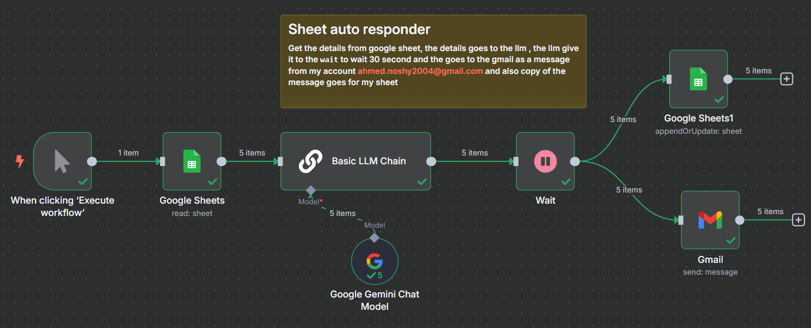
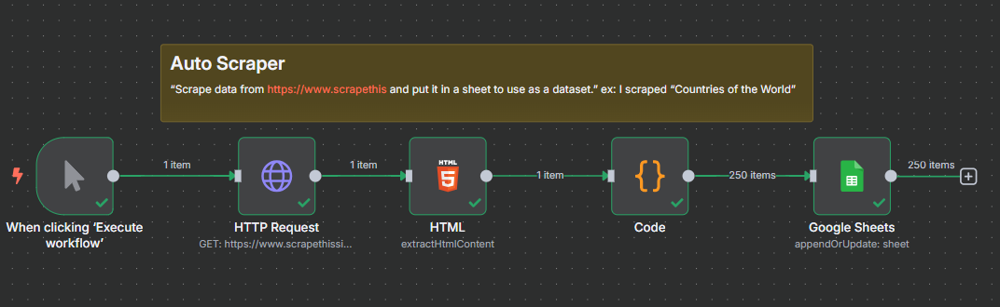
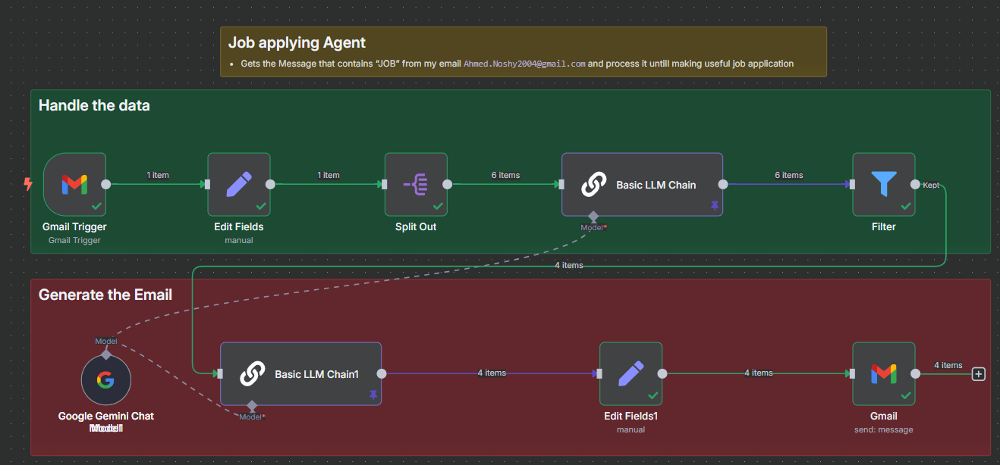
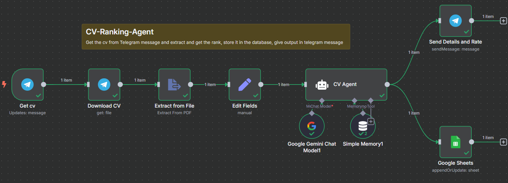
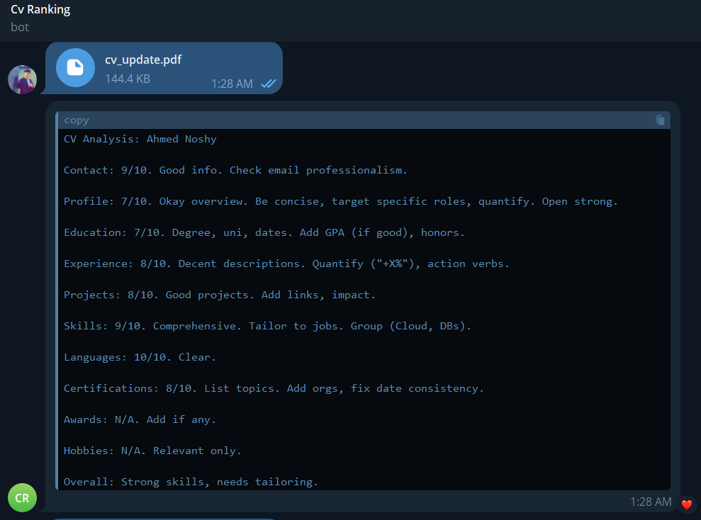
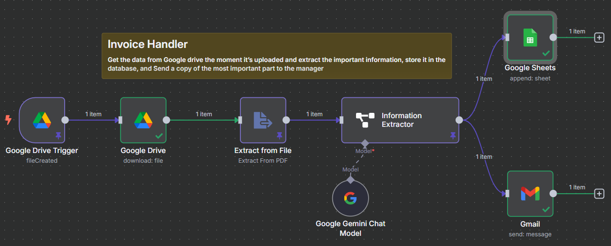
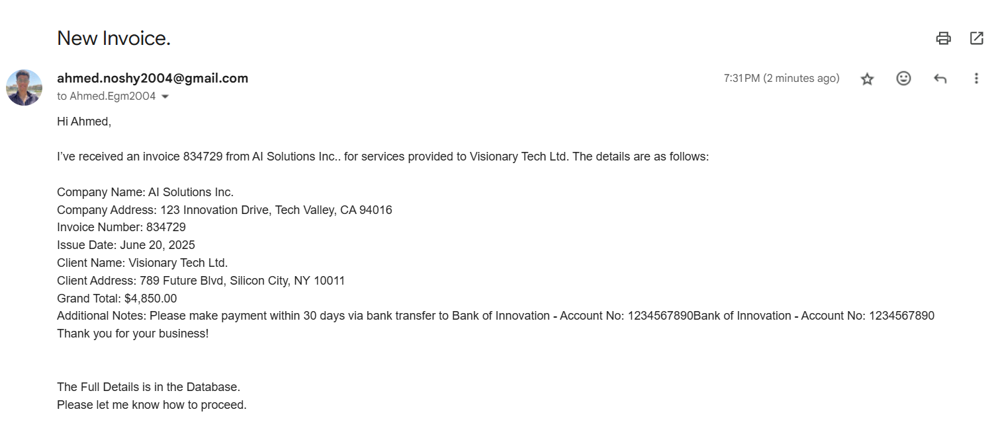
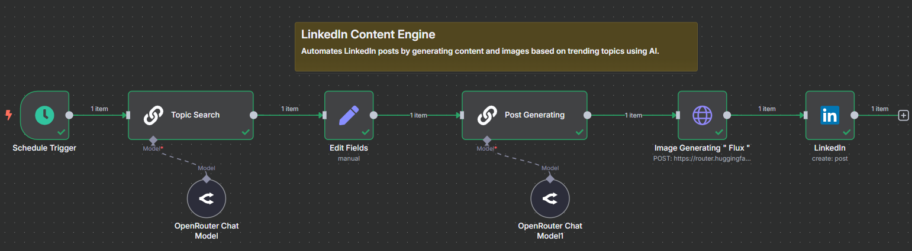
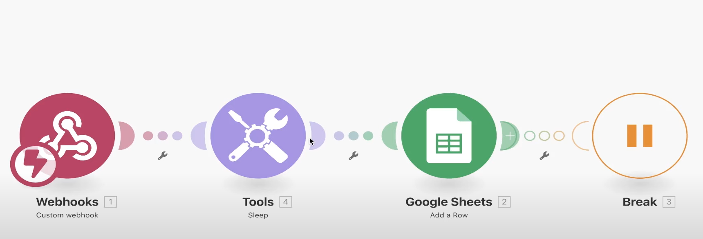

# My-Automation-Projects
> Every word here is written by me, so forgive me for any mistake.

-------------------------------------------------------------------------------------------

## (1) 📩 Sheet Auto Responder

This project automates the process of reading user data from a Google Sheet, generating an AI-based response using a large language model (LLM), and sending that response via Gmail — while also logging the reply back to a Google Sheet.

### ⚙️ Workflow Overview

The automation is executed when the user manually triggers the workflow. The steps are as follows:

First i have the **Trigger Event** which means that The workflow starts when clicking **"Execute workflow"**.
this step takes me to **Read Google Sheet** to Read the data from my **Google Sheet**.
After that it goes to **Generate Response (LLM)** step when The data is passed to a **Basic LLM Chain** using the **Google Gemini Chat Model** to generate a relevant, human-like reply.

which takes me to the **Wait Delay** 
what is that ? it's A 30-second delay (`Wait`), the purpose i did it is to introduced to simulate thinking time or ensure asynchronous processing ( to delusion the customar that this is a human work not an automation).

**The final step is splited into half**

**Send Email (Gmail)**  
   The AI-generated response is sent via **Gmail** from my account `ahmed.noshy2004@gmail.com` to the intended recipient.

and also **Log to Google Sheet**  
   A copy of the response is also appended to another Google Sheet (`Google Sheets1`) for logging and tracking purposes.

-------------------------------------------------------------------------------------------
## (2) 📡  Auto Scraper

This project automates the process of scraping country data (Country Name, Country Population, Country Area, Country Capital) from a website, for example I used [Scrapethis](https://www.scrapethissite.com/pages/simple/) then 
processing it, and updating a Google Sheet — all triggered manually.

The dataset was scraped and stored in [ScrapedDataset](Auto_Scraper/countries.xlsx)

### ⚙️ Workflow Overview

The automation begins when the user manually triggers the workflow. The steps are as follows:

First, the **Trigger Event** initiates the process by clicking **"Execute workflow"**. This leads to the **HTTP Request step**, performing a GET request to scrape data from the website
Next, the **HTML step** parses the retrieved web content. This is followed by the Code step, where the data is processed to extract  [Country Name, Country Population, Country Area, and Country Capital].

-- I COULD JUST USED ( SPLIT OUT ) BUT I WANTED TO TEST MY JAVASCRIPT CODE ABILITY😂 

The final step is to Update **Google Sheet**, where the scraped data (up to 250 items) is appended to a Google Sheet for storage and tracking

-------------------------------------------------------------------------------------------

## (3) 💼 Job Applying Agent

This project automates the process of handling daily job application messages, filtering relevant job offers based on personal qualifications, generating tailored job applications, and sending them via email to the respective companies.

### ⚙️ Workflow Overview
I subscribed in a Jobs service which gives me a message daily that contains job applications,
The automation is triggered when a message containing the word “job” in the title arrives. The steps are as follows:

The first step is executed when the message containing the word **“job”** in the title arrives.

 After that, I created an **edit field** to clean and split the jobs into arrays, every array is linked to an individual job offer.  
 
The array goes directly to the **split out** step to change the array into a proper schema that can be fed into the LLM chain. The first LLM model has my own personal, Technical data and filters the jobs based on my data into 2 categories:   

`1- useful job offers > match my skills and qualifications`   

`2- not useful job offers > doesn’t match my skills and qualifications`

After that, it goes to the filter to keep the **useful job offers** and neglect the not useful job offers.

when the data that comes out is only useful now, it goes to `LLM Chains` to create the job application for the companies, **It gathers info about the company and generate it**,   
**and also creates the right schema of the Email that’ll be sent to the companies**.   

The final step is feeding the data that comes from the final node into the email to send the job applications to the **useful job offer**  

here's an example of the result:

-------------------------------------------------------------------------------------------

## (4) 📊 CV Ranking Agent

This project automates the process of receiving CVs via Telegram messages, extracting and analyzing candidate information, ranking candidates based on qualifications, and storing the results in a database while providing feedback through Telegram.

### ⚙️ Workflow Overview
I set up a system to receive CV submissions through Telegram messages for efficient candidate screening and ranking.
The automation is triggered when a message containing a CV file arrives via Telegram. The steps are as follows:

The first step is executed when a **CV file** is received through the Telegram bot.
After that, the system **downloads the CV file** to prepare it for processing and analysis.

The downloaded file goes to the **Extract from File** step which uses PDF extraction capabilities to convert the CV content into readable text format. The extracted text is then processed through an **Edit Fields** step to clean and structure the candidate data into a proper format.

The structured data is fed into the **CV Agent** which utilizes both **Google Gemini Chat Model** and **Simple Memory** tools to:

`1- Analyze candidate qualifications and experience`

`2- Compare against job requirements and company standards`

`3- Generate a comprehensive ranking score`

After the AI analysis, the system processes the ranking results and stores them in the **Google Sheets** database through the `appendOrUpdate` operation, maintaining a persistent record of all candidates.

The final step sends the **ranking details and feedback** back to the original Telegram conversation, providing instant results to the recruiter or hiring manager.

Here's an example of the workflow in action:

-------------------------------------------------------------------------------------------

## (5) 🖨 Invoice Handler

This project automates the process of handling  invoices and bills when uploaded to Google Drive, extracting all of it's information, storing them in a database, and sending a summary to the manager.

### ⚙️ Workflow Overview

The automation is triggered when a new file is uploaded to a specific folder i created in my Google Drive. The steps are as follows:

The process begins when a new file is uploaded `(fileCreated event)`.

After that, the `Google Drive Download` step downloads the uploaded file.
The file is then processed by the `Extract from File` step to extract data from the PDF.
The extracted data goes to the `Information Extractor` step, which uses the `Google Gemini Model` to identify and extract critical invoice information, The extracted information is appended to `Google Sheets`.

The final step **sends a message** with the ( most important ) details to the manager via Gmail.

 You Can see the invoice i used here : [Invoice](Invoice_Handler/Invoice.pdf)

 You can also the the Database which the data stored in here : [Database](Invoice_Handler/Database.xlsx)

 This an example of the Automation process of the Most important details that delivered in the Manager's Email : 

-------------------------------------------------------------------------------------------

## (6) 🔗 LinkedIn Content Engine

This project uses advanced AI to automate LinkedIn content creation and posting, generating engaging posts and high-quality images based on trending topics, enhancing my social media presence efficiently.

### ⚙️ Workflow Overview

The automation is initiated by a Schedule Trigger, Exactly at 6:30 P.m ( the best timing for Linkedin Reach), ensuring timely updates. The process unfolds as follows:

The process begins when the Schedule Trigger activates at predefined intervals as i said above.

Next, the **Topic Search** module, powered by an AI model ( `DeepSeek R1` ) , its tasks is to  **identifies the latest trending topics**, Also **generates a prompt for the Image Generation Node** to keep content relevant and engaging.

The output is then routed to the **`Edit Fields`** step, Which splits the Output from the Topic search to Two branches  `1- Trending topic`,  `2- Image prompt`

Subsequently, the Post Generating phase utilizes an AI model to craft polished and professional post content tailored to the audience based on the **Trending Topic**.

Following that, the Image Generating step takes the **Image Prompt** and employs the cutting-edge "Flux" model [Here](https://huggingface.co/black-forest-labs/FLUX.1-schnell?inference_api=true&inference_provider=hf-inference&language=js) to produce visually appealing images that complement the posts.

The final step involves feeding the refined content and images into the LinkedIn module, which smoothely creates and publishes the posts to your profile.

You Can see th result : 

-------------------------------------------------------------------------------------------

## (7) 📊 Analytics Automation Engine
### this is my first project with make.com and probably the last 

This project automates the collection and processing of analytics data, streamlining the workflow to enhance data-driven decision making.

### ⚙️ Workflow Overview

The automation is triggered by incoming data. The steps are as follows:

The process begins when the **Webhooks** module receives data via a custom webhook.

Next, the **Tools** module, including a sleep function, processes the incoming data to prepare it for analysis.

The processed data is then sent to the **Google Sheets** module, where a new row is added to store the analytics.

Finally, the **Break** step pauses the workflow to allow for data review or further processing.

